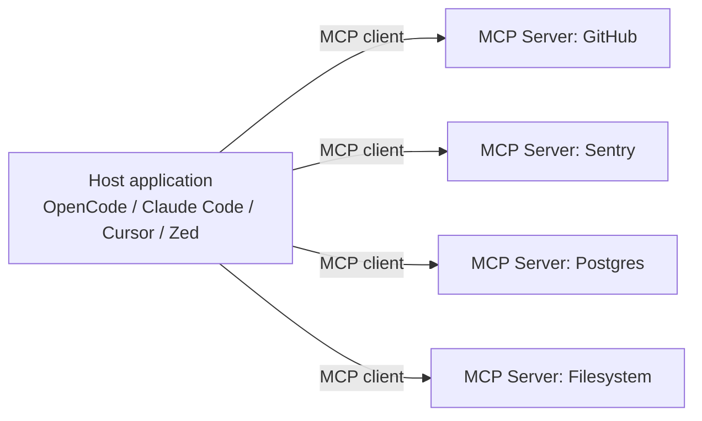

# Model Context Protocol (MCP)

> [!quote] Tagline
> "USB-C for AI" — one protocol, many tools, any LLM client.

The **Model Context Protocol** is an open standard, originally introduced by Anthropic in late 2024, for connecting LLM applications ("hosts") to external data and tools ("servers"). It standardizes the *integration layer* the same way LSP standardized editor↔language-server integration.[^mcp]

Before MCP, every editor / agent had to write a custom adapter for every external service (GitHub, Sentry, your DB, …). After MCP, a service exposes one MCP server and any compliant client can speak to it.

## Architecture

Three roles:[^mcp-spec]

| Role | What it is | Example |
|---|---|---|
| **Host** | The LLM application the user talks to | OpenCode, Claude Code, Cursor |
| **Client** | Per-server connection inside the host | one per configured MCP |
| **Server** | The integration — exposes tools, resources, prompts | `@modelcontextprotocol/server-github` |

## What MCP servers expose

Three primitives:[^mcp]

| Primitive | What it is | Analogy |
|---|---|---|
| **Tools** | Callable functions with typed args/return | RPC method |
| **Resources** | Read-only data the LLM can fetch | URL / file |
| **Prompts** | Reusable, parameterized prompt templates | Snippet |

Most production MCP servers focus on **Tools** — that's where the action is.

## Transports

Two main transports:

| Transport | When | Used by |
|---|---|---|
| **stdio** | Server runs as a local subprocess | local CLI tools, dev tooling |
| **HTTP / SSE** | Server is a remote service | hosted MCPs (Sentry, Context7, Grep) |

In OpenCode these surface as `type: "local"` and `type: "remote"`. See [[MCP Servers]].

## Auth

Remote MCPs commonly use OAuth 2.0 with **Dynamic Client Registration (RFC 7591)** so clients can self-register without manual setup. OpenCode handles this automatically — first call hits 401, browser opens, tokens stored.[^oc-mcp]

## Why it matters

1. **Network effect for tools.** Building an MCP once makes your tool available in every compliant client.
2. **Network effect for clients.** Building a client once gives you access to every MCP.
3. **User control.** The user — not the vendor — picks which integrations are loaded. Compare with closed plugin ecosystems.
4. **Open governance.** The spec is published, the SDKs are open source, the ecosystem moves independently of any single vendor.

This is the *same* dynamic that LSP, OCI, and OpenAPI created in their respective layers.

## Caveats

> [!warning] MCPs cost context budget
> Each enabled server contributes its **full tool catalog** to the prompt on every turn. This is a recurring tax. See [[Context Engineering]] and the [[MCP Servers#Scoping per agent|per-agent scoping]] pattern.

> [!warning] Trust boundary
> An MCP server is code you didn't write running with the agent's privileges. Pin versions, read what you install, and constrain via [[Permissions]].

## Adoption (selected)

Hosts/clients implementing MCP include OpenCode, Claude Code, Cursor, Zed, Continue, Cline, Sourcegraph Cody, and more. The list grows weekly; the canonical registry is maintained at [modelcontextprotocol.io](https://modelcontextprotocol.io).[^mcp]

## See also

- [[MCP Servers]] — OpenCode's binding, with concrete config
- [[AGENTS.md Standard]] — sister-standard for *instructions* (not tools)
- [[Context Engineering]] — why MCP discipline matters

---
**Sources:** [^mcp] [^mcp-spec] [^oc-mcp]
