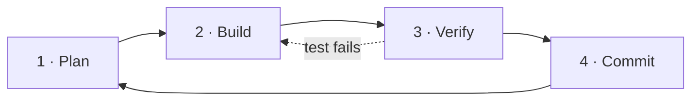

# The Plan-Build-Verify Workflow

The single most reliable pattern for shipping with an agent. Anthropic recommends a four-phase loop: **Explore → Plan → Code → Commit**.[^cc-best] Most practitioners collapse Explore into Plan and add an explicit Verify, giving:



Skipping any phase produces a recognizable failure. Skipping **Plan** → wasted edits. Skipping **Verify** → confident-but-broken commits. Skipping **Commit** → lost work and incoherent history.

---

## Phase 1 — Plan

**Goal:** establish shared understanding before touching code.

Activities:
- Read relevant files (use `read`, `grep`, `glob`)
- State the problem in one sentence
- List the affected files
- Sketch the change (pseudocode, signatures, data flow)
- Identify risks and open questions
- Commit the plan to writing — usually as a markdown todo or a brief in chat

> [!tip] Force the plan
> Use a planning agent ([[Agents|plan mode]]) that has **`edit: deny`**. The agent literally cannot start coding until you switch modes. This is the most effective single technique against premature implementation.

Output: a written plan you (the human) have read and approved.

---

## Phase 2 — Build

**Goal:** translate the plan into code, one focused change at a time.

Rules:
- One concern per session if possible — don't conflate refactor + feature + bugfix
- Keep edits small and reviewable (≤ 200 lines per logical step)
- Re-read before edit when uncertain (cheap insurance against stale assumptions)
- Use [[Sub-Agents and Delegation|subagents]] for expensive side quests (large searches, doc analysis) so the main session stays focused

Output: code that the agent believes implements the plan.

---

## Phase 3 — Verify

**Goal:** prove the change is correct before you trust it.

The verify phase is what separates "looks done" from "is done." Three layers:

| Layer | Tool | Catches |
|---|---|---|
| Static | type checker, linter | typos, type errors, style |
| Dynamic | unit & integration tests | logic errors |
| Empirical | run the actual code path | env / wiring / config issues |

For agentic work, **always run the tests yourself** — don't trust the agent's claim of "tests pass." A surprisingly common failure mode is the agent stopping at the first command that returns 0, even if no tests actually ran.

> [!tip] Test-driven gives the agent a target
> Writing the test *first* (Red), letting the agent implement (Green), then asking for refactor (Refactor) is the classic TDD loop and works extremely well with agents because the test gives them an objective signal of "done."[^cc-best]

Output: green tests + a manual sanity check.

---

## Phase 4 — Commit

**Goal:** crystallize the unit of work and clear context.

- Atomic commit, descriptive message, conventional commits if your repo uses them
- Update `AGENTS.md` if you discovered a project convention worth persisting
- **Compact the conversation** — the work is done; the raw exploration is no longer needed

This is also the natural [[Context Engineering|compression]] point. Summarize: "Implemented X. Files A, B touched. Tests pass." That summary becomes the floor for the next task.

---

## Why this beats one-shot prompting

| One-shot prompt | Plan-Build-Verify |
|---|---|
| Agent guesses intent | Intent stated and reviewed |
| Edits made before context loaded | Context loaded, then edits |
| Success unverified | Tests are the contract |
| Session sprawls forever | Natural compression boundary |
| Next task inherits noise | Next task starts fresh |

The four-phase loop is slower per turn but **dramatically faster end-to-end** because rework drops.

---

## A worked OpenCode session

```
[Plan agent — edit:deny]
> Add rate limiting to /api/login
agent: reads src/api/login.ts, src/middleware/, tests/
agent: writes plan into chat — proposes express-rate-limit, file changes, test cases
human: approves, switches to build agent

[Build agent]
agent: edits middleware, login route, adds test
agent: runs `npm test` — fails on edge case
agent: fixes, re-runs — green

[human]
> verify
agent: runs full suite, then curls /api/login 6 times to confirm 429
human: ✅

[human]
> commit
agent: git commit -m "feat(auth): rate-limit /api/login (5/min)"
```

Total turns: ~8. Total rework: zero.

## Concrete instantiations

The four-phase loop shows up under different names in different systems:

| System | Plan | Build | Verify | Commit |
|---|---|---|---|---|
| Anthropic best practices[^cc-best] | Explore + Plan | Code | (implicit) | Commit |
| OpenCode plan/build modes | `mode: plan` (`edit: deny`) | `mode: build` | tests | git |
| [[GSD (Get Shit Done)]][^gsd-readme] | `/gsd-discuss-phase` + `/gsd-plan-phase` | `/gsd-execute-phase` | `/gsd-verify-work` | `/gsd-ship` |

GSD adds an explicit `discuss` step *before* `plan` to capture implementation decisions (layouts, API shapes, error handling) that the human imagines but rarely states upfront — a useful refinement when the agent would otherwise plan against reasonable-but-wrong defaults.

## See also

- [[Agents]] — plan mode vs build mode in OpenCode
- [[Sub-Agents and Delegation]] — keeping the main session uncluttered during Build
- [[Context Engineering]] — why the Commit phase doubles as compression
- [[Common Failure Patterns]] — what skipping each phase looks like

---
**Sources:** [^cc-best] [^oc-agents] [^gsd-readme]
