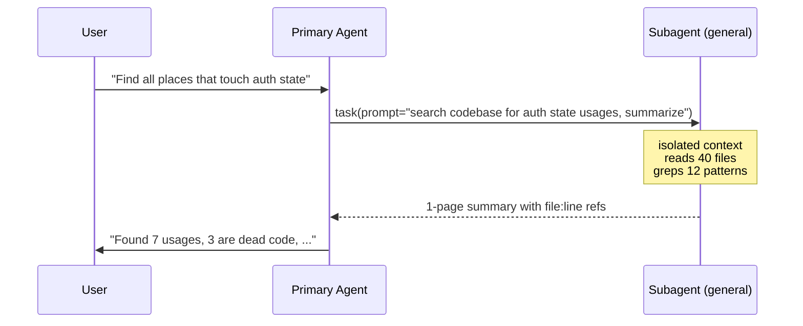

# Sub-Agents and Delegation

A **subagent** is a child agent invoked from a parent session with its **own isolated context window**. The parent gets back only the subagent's final summary — the noisy tool calls, file reads, and exploration never enter the parent's context.

This solves two problems at once:

1. **Context pollution** — heavy exploration would otherwise crowd out the main task
2. **Parallelism** — multiple subagents can fan out concurrently, each on a self-contained slice

## The mental model

> [!quote] Subagents are functions, not coworkers.
> You hand them a precise input (a task description), they produce a precise output (a summary), and what happened internally is opaque. Treat them like a unit-tested function call.

Concretely in OpenCode:



The parent's context grew by ~1 page of summary; the subagent's 40 file reads and 12 greps stayed in the subagent.

## When to delegate

Strong fit:

- **Codebase exploration** — "find every X across the repo"
- **Doc / source analysis** — reading a spec or large markdown corpus
- **Pattern mining** — comparing many similar files to extract a convention
- **Independent verification** — second agent re-reads the diff with fresh eyes
- **Heavy MCP queries** — keeping noisy tool output out of the main session

Weak fit:

- Tasks that require the parent's accumulated context (the subagent has none)
- Tightly interactive edits where you want to see every step
- Trivial work — delegation has overhead, both for tokens and latency

## Patterns

### Fan-out for survey

```
parent: "I need to refactor logging across the service.
         Spawn 3 subagents in parallel:
         - one to map all current logger usages
         - one to identify the destination format we want
         - one to find tests that assert log content
         Each returns a summary."
```

Three subagents, three isolated contexts, three summaries. Parent synthesizes.

### Plan/Build separation

The [[Plan-Build-Verify Workflow|plan agent]] is itself a kind of delegation: a subagent with `edit: deny` permissions that can only think and read. Its output (the plan) becomes the input for a build agent.

### Independent review

After implementation, spawn a fresh subagent: *"Read the current diff. Find bugs. Don't trust prior conversation."* Because it has no context from the build session, it can't be biased by prior reasoning.

### Specialist-by-skill

Pre-defined subagents in `.opencode/agent/*.md` with focused descriptions, narrow tool sets, and tight permissions. Examples:

- `security-reviewer` — read + grep only, system prompt focused on OWASP-style checks
- `test-writer` — edit limited to `tests/**`, system prompt focused on coverage
- `migration-runner` — bash limited to `npm run migrate*`

> [!example] Real-world implementation
> [[GSD (Get Shit Done)]] industrialises the fresh-context pattern: every executor task starts with its own ~200k-token context, plans run in parallel waves, and each task produces an atomic commit. The main session stays at 30–40% utilisation because all the heavy work happens in children.[^gsd-readme] It's a useful proof point that this pattern scales beyond ad-hoc one-offs into a default workflow.

## The delegation cost model

Every delegation has overhead:

| Cost | Typical magnitude |
|---|---|
| Spawn / system prompt | ~1–3K tokens (subagent's own system prompt) |
| Round-trip latency | seconds (whole sub-session) |
| Quality of summary | depends entirely on subagent's prompt |

The break-even is roughly: **delegate if the subagent would otherwise consume more parent context than ~3K tokens.** Below that, doing it inline is cheaper.

## Common mistakes

> [!failure] Vague subagent prompt
> "Look around and tell me what you find" → subagent meanders, returns vague summary.
> **Fix:** state the goal, the deliverable, and the file/scope boundaries.

> [!failure] Expecting shared memory
> Parent: "Use the result from the previous subagent." Subagent: has no idea what that is.
> **Fix:** the parent must explicitly pass relevant prior findings into the new prompt.

> [!failure] Over-delegation
> Spawning a subagent for a 30-second task. The orchestration overhead exceeds the work.
> **Fix:** keep delegation for tasks that are either context-heavy or naturally parallel.

> [!failure] No success criterion
> Subagent says "done" — but did it actually verify?
> **Fix:** specify the verification step *inside* the subagent prompt ("run the tests and report the count").

## See also

- [[Agents]] — OpenCode's agent system, primary vs subagent modes
- [[Context Engineering]] — the underlying motivation
- [[Plan-Build-Verify Workflow]] — where delegation slots in

---
**Sources:** [^cc-best] [^oc-agents] [^gsd-readme]
