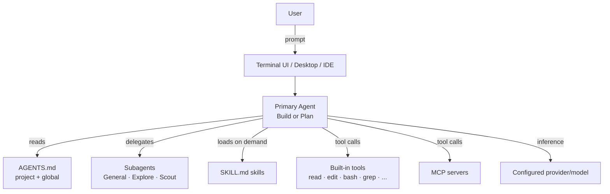

# OpenCode Overview

**OpenCode** is an open-source AI coding agent built by [Anomaly](https://anoma.ly). It is delivered as a terminal UI (TUI), a desktop app, and IDE extensions, and is BYO-LLM via configurable providers.[^oc-docs]

> [!quote] In one line
> *"An AI coding agent built for the terminal."*[^oc-docs]

## What makes it distinct

| Property | OpenCode |
|---|---|
| **License** | Open source (see [GitHub repo][^oc-github]) |
| **Primary surface** | Terminal (TUI) — also desktop, web, IDE |
| **Model layer** | BYO-key for Anthropic / OpenAI / Bedrock / etc., or use the curated [OpenCode Zen][^oc-zen] |
| **Config** | JSON / JSONC, layered & mergeable — see [[Configuration]] |
| **Extensibility** | [[Agents]], [[Skills]], [[MCP Servers]], custom tools, plugins, hooks |
| **Compatibility** | Reads `CLAUDE.md` and `.claude/skills/` for [[Rules and AGENTS.md|drop-in migration from Claude Code]] |

## Mental model

## Where to next

- Set it up → [[Installation]]
- Tune it → [[Configuration]]
- Understand the agent layer → [[Agents]]
- Add reusable behavior → [[Skills]]
- Connect external tools → [[MCP Servers]]
- Lock down what it can do → [[Permissions]]

---

**Sources:** [^oc-docs] [^oc-github]
